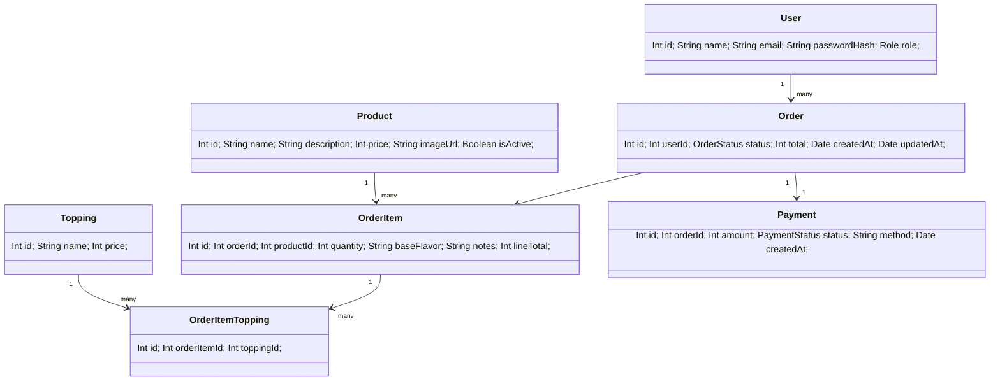

# Heladería Frío Natural — API (Express + Prisma + SQLite)

## Cómo ejecutar
```bash
npm install
npx prisma generate
npx prisma migrate dev --name init
npm run db:seed
npm run dev
```
La API arrancará en `http://localhost:3000`.

## Entidades (Diagrama de clases)


## Rutas
### Auth
- `POST /auth/register`
- `POST /auth/login` → `{ token }`

### Catálogo
- `GET /catalog/products`
- `GET /catalog/toppings`

### Carrito (token)
- `GET /cart`
- `POST /cart/items` `{ productId, quantity, baseFlavor, notes, toppingIds }`
- `POST /cart/checkout`

### Pedidos (token)
- `GET /orders/:id`
- `GET /orders/:id/status`
- `GET /orders/:id/receipt`

### Pagos (mock)
- `POST /payments` `{ orderId, method }`

### Admin (token + role=ADMIN)
- `GET /admin/users`
- `PUT /admin/users/:id/role`
- `GET /admin/orders`
- `PATCH /admin/orders/:id/status`

### Reportes de Ventas (Admin)
- `GET /reports/sales?from=YYYY-MM-DD&to=YYYY-MM-DD&productId=&userId=&groupBy=none|day|month`
- `GET /reports/sales.xlsx?...`
- `GET /reports/sales.pdf?...`

### Filtros y agrupaciones en `/reports/sales`
Parámetros opcionales:
- `from`, `to` (YYYY-MM-DD)
- `productId`, `userId`
- `groupBy` = `none` (default) | `day` | `month`

Ejemplos:
- `GET /reports/sales?from=2025-10-01&to=2025-10-31&groupBy=day`
- `GET /reports/sales?productId=3&groupBy=month`
- `GET /reports/sales?userId=5`
